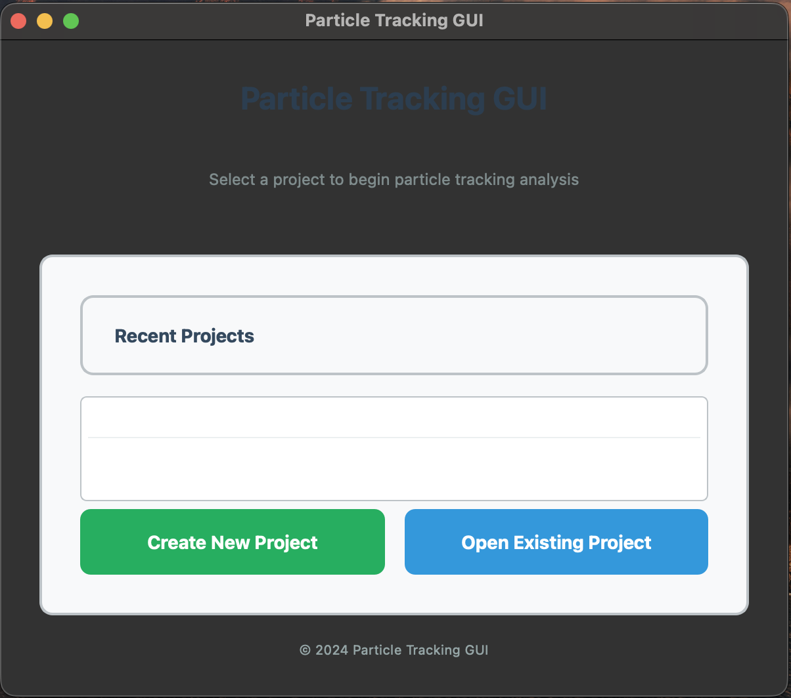
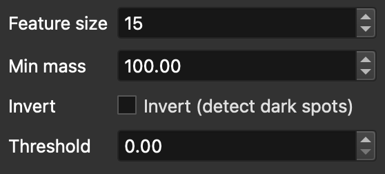
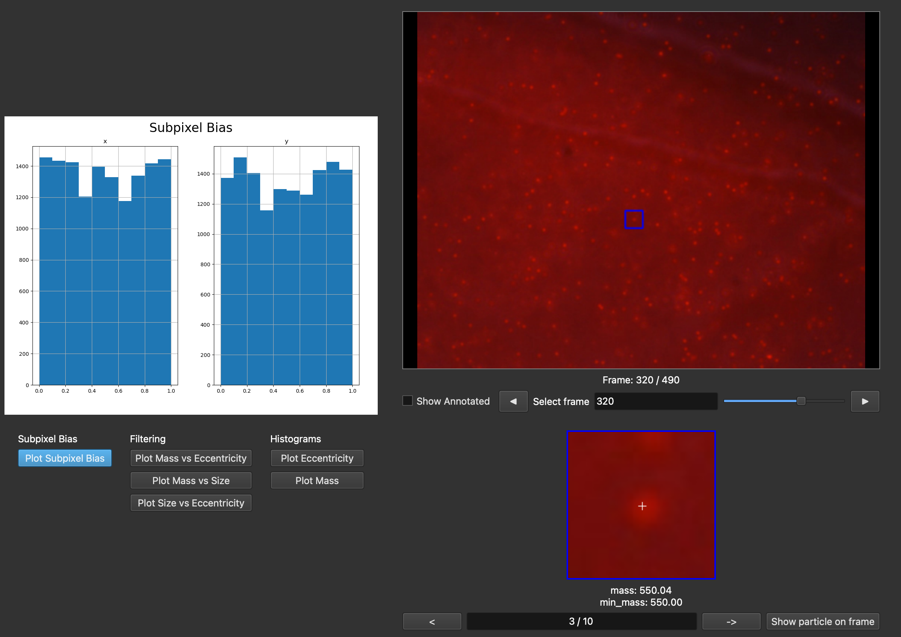
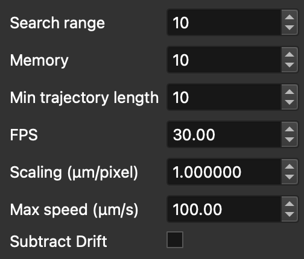
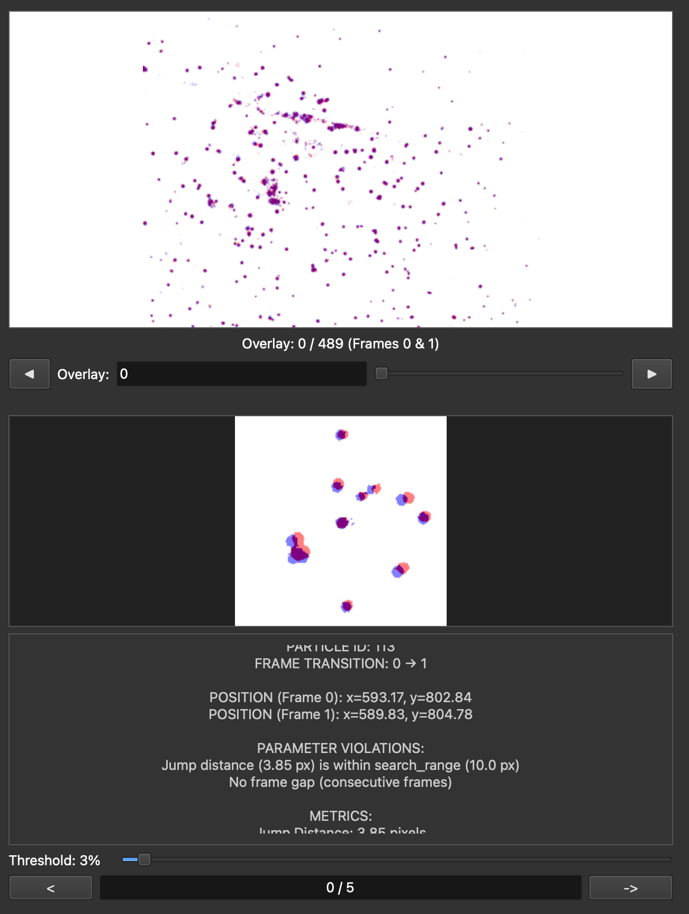
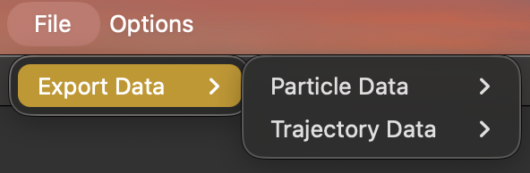

# Particle Tracking GUI

This project is a workflow facilitator for particle detection and tracking with `trackpy`. It streamlines the process from raw microscopy videos through detection, linking, review, and export, presenting parameter controls, diagnostics, and visualization galleries (including enhanced red-blue link overlays) in a single PySide6 desktop application so students can find data quickly without writing scripts.

---
## Installation
We recommend `conda` for managing and building the required environment for this project. Other options are possible, but the following guide is for conda setup

1. **System Prerequisites:**
    * Python 3.10 or later

2.  **Download `conda`**
    * https://www.anaconda.com/download

3.  **Create & Activate Conda Environment:**
    ```bash
    conda create -n particle-tracking-gui python=3.10
    conda activate particle-tracking-gui
    ```

4.  **Install Dependencies Into Conda Environment:**
    ```bash
    conda install -c conda-forge ffmpeg PySide6 trackpy opencv numpy pandas scipy matplotlib pims imageio pillow
    ```

---

##  Running the Application

1.  **Ensure your conda environment is active.**
    ```bash
    conda activate particle-tracking-gui
    ```
2.  **Launch the GUI:**
    ```bash
    python run.py
    ```

---

## Using the Application

1.  Create and name a new project folder and choose its location, or open an existing one. This folder will contain data from the workflow prcoess.



2.  Import a video by clicking on the video player or doing menu bar -> File -> Import video. After the video is imported, use controls under video to see its frames. (Once particles have been found, press "Show annotated" to see the identified particles highlighted.)


3.  Choose particle detection parameters.



4.  Select what frames you want to find particles in, then press "Find particles" use trackpy's locate on the frames you've selected. Be aware that the more frames you select, the longer the location process will take. Pressing "All frames" sets start to 1, end to total frames, and step to 1. See above the controls for progress information on finding particles.


5.  Review the graphs and errant particle gallery to check the quality of the particle location process. If you are not satisfied, return to step 3, otherwise find particles in as many frames as you like and press the next button.
    1.  Using errant particle gallery: swipe through the images and see check that all particles are real. If you want more information, press the "Show particle on frame" button to see it highlighted in its frame. See notes under image to see why it was errant.
    2.  Using graphs: use buttons to switch between graphs. Take a look at the characteristics of the particles found.



6.  Choose trajectory linking parameters.



7.  Review the red-blue overlay of trajectory linking. One frame is red, the next is blue, use the threshold slider to filter out visual noise and hone in on particles. Use the bottom window and its controls to review the most errant linkings to see if they are reasonable from one frame to the next. Use the upper window and its controls to review full frames overlayed on one another. If you are satisfied, continue, otherwise go back to step 6.



8.  Export your particle data by doing menu bar -> file -> export data



## Workflow Diagram

